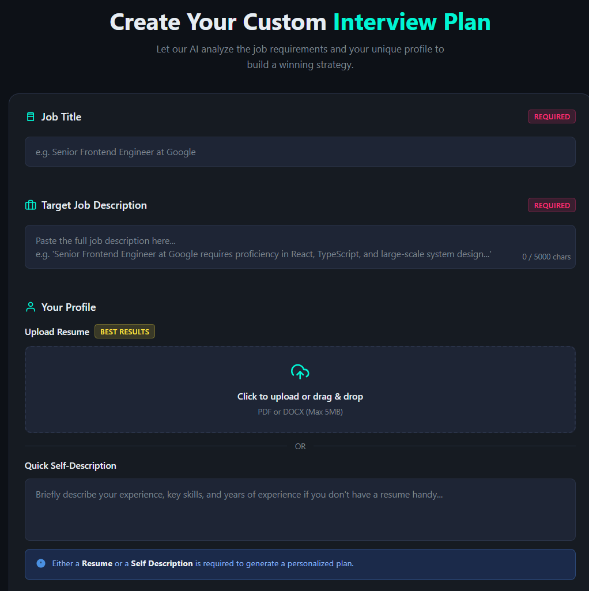
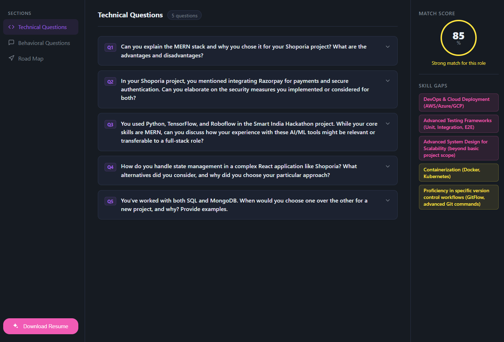
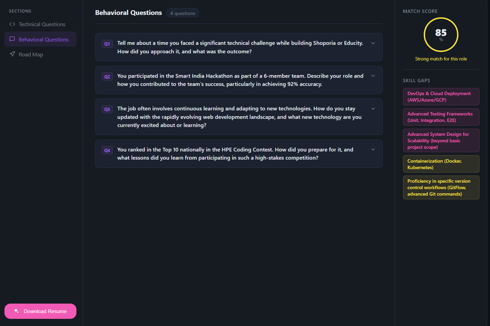
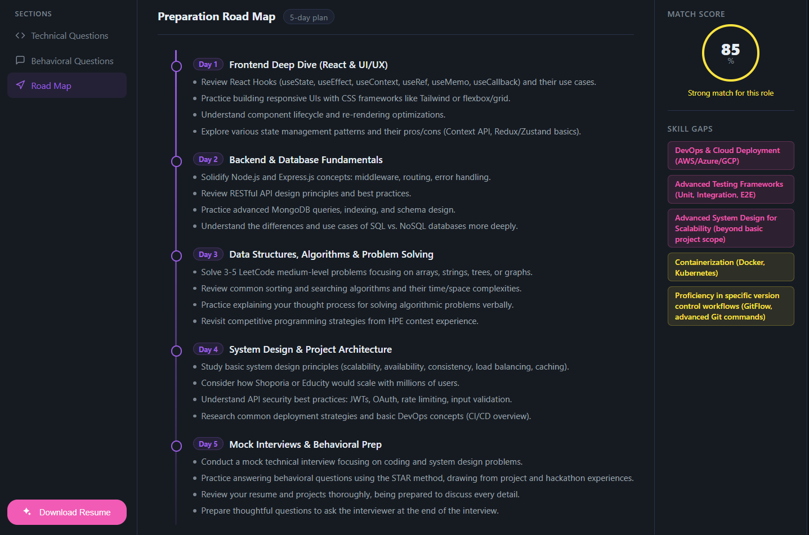
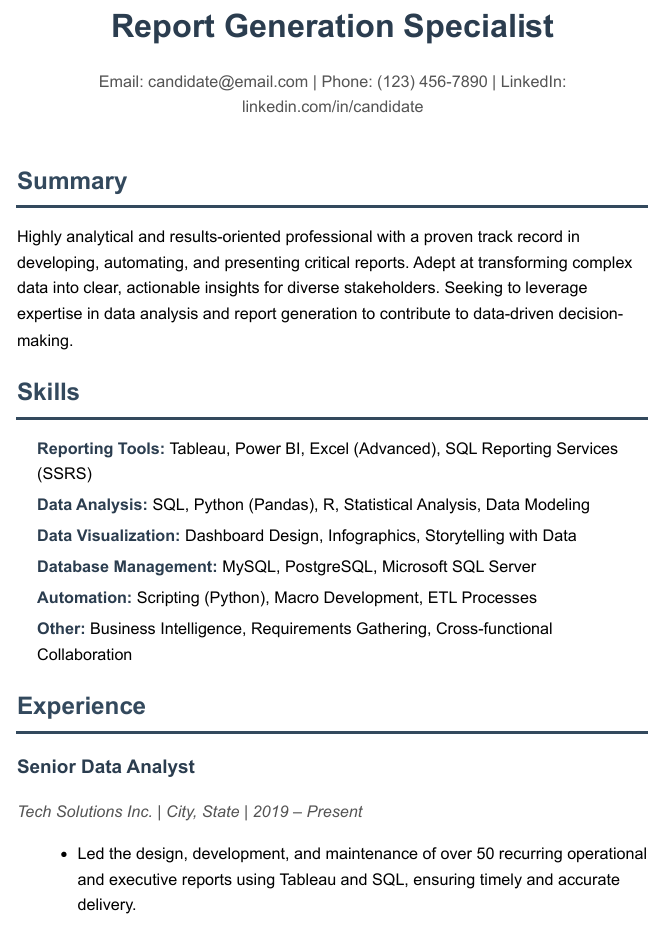
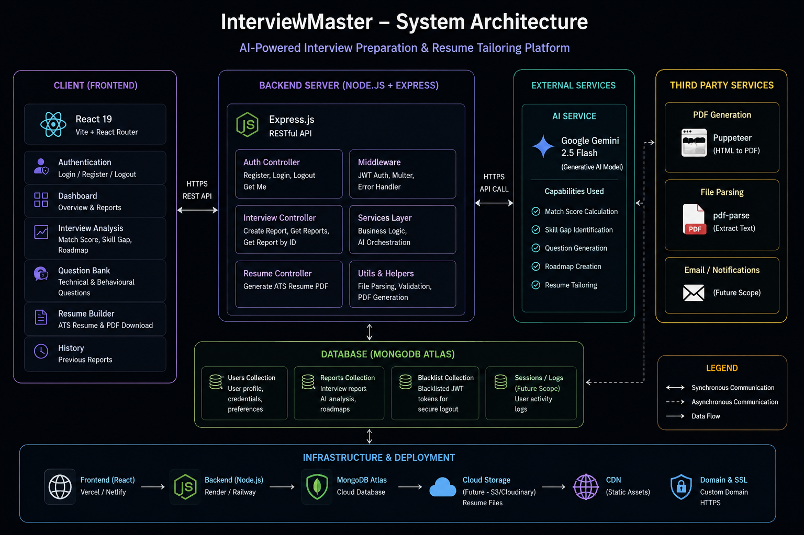

<div align="center">

#  InterviewMaster

### **Your Personal AI Interview Coach**

*An AI-powered platform that analyzes your resume against any Job Description, identifies skill gaps, creates personalized preparation roadmaps, generates interview questions, and builds ATS-friendly resumes.*

<br>


</div>

---

# 🎥 Demo

> **Replace these with your own GIFs or screenshots**

<p align="center">



</p>

---

# ✨ Why InterviewMaster?

Most interview preparation platforms only generate questions.

**InterviewMaster goes several steps further.**

It acts as an AI Interview Coach that can:

✅ Analyze Resume vs Job Description

✅ Calculate Match Score

✅ Detect Missing Skills

✅ Build Personalized Preparation Roadmap

✅ Generate Technical Questions

✅ Generate Behavioural Questions

✅ Explain Interviewer's Intent

✅ Create ATS Optimized Resume

✅ Export Resume as Professional PDF

---

#  Features

<table>

<tr>

<td width="50%">

### 🎯 Resume Match Analysis

Upload your resume and compare it against any Job Description using Google's Gemini 2.5 Flash.

</td>

<td width="50%">

### 📈 Skill Gap Detection

Identifies missing technologies and classifies them by impact.

</td>

</tr>

<tr>

<td>

### 🧠 AI Technical Questions

Generates personalized interview questions with detailed model answers.

</td>

<td>

### 💬 Behavioural Interview Prep

STAR-based behavioural questions with guidance and expected talking points.

</td>

</tr>

<tr>

<td>

### 📅 Personalized Study Roadmap

Creates day-wise preparation plans based on remaining interview time.

</td>

<td>

### 📄 ATS Resume Builder

Automatically rewrites and generates an ATS-friendly resume PDF.

</td>

</tr>

</table>

---

# 🖼️ Application Preview

## Dashboard


---

## Technical Questions



---

## Behavioral Questions



---

## Roadmap



---

## Resume Builder



---

# 🧠 AI Workflow

```text
                    User Input
                         │
        Resume + Job Description
                         │
                         ▼
              Gemini 2.5 Flash Analysis
                         │
        ┌────────────────┼────────────────┐
        ▼                ▼                ▼
 Match Score      Skill Gap        Resume Parsing
        │                │                │
        └────────────────┼────────────────┘
                         ▼
         Interview Preparation Engine
                         │
        ┌────────────────┼────────────────┐
        ▼                ▼                ▼
 Technical Qs     Behavioural Qs     Study Roadmap
                         │
                         ▼
               ATS Resume Generator
                         │
                         ▼
                 Download PDF Resume
```

---

# 🏗️ System Architecture

<p align="center">



</p>

---

# ⚡ Tech Stack

| Frontend | Backend | AI | Database | Other |
|-----------|----------|------|-----------|------------|
| React 19 | Node.js | Gemini 2.5 Flash | MongoDB | JWT |
| React Router | Express | Google GenAI SDK | Mongoose | Puppeteer |
| Context API | REST APIs | Zod | Mongo Atlas | pdf-parse |
| SCSS | Axios | JSON Schema | | Multer |

---

# 📂 Project Structure

```text
resume_app/

├── Backend/
│
├── Frontend/
│
├── README.md
│
└── package.json
```

---

# 🏛 Backend Architecture

```
Routes

↓

Controllers

↓

Services

↓

Gemini AI

↓

MongoDB

↓

Response
```

---

# ⚛ Frontend Architecture

```
UI Components

↓

Hooks

↓

Context API

↓

Services

↓

REST API
```

---

# 📊 Project Highlights

✔ Gemini 2.5 Flash Integration

✔ Resume Parsing

✔ AI-powered Match Score

✔ AI Skill Gap Analysis

✔ Personalized Interview Roadmaps

✔ Behavioural + Technical Questions

✔ ATS Resume Builder

✔ PDF Resume Rendering

✔ JWT Authentication

✔ HTTP-only Cookies

✔ Protected Routes

✔ Modular React Architecture

✔ RESTful Backend

✔ Responsive UI

✔ Feature-first Folder Structure

---

# 📦 Installation

## Clone Repository

```bash
git clone https://github.com/yourusername/interviewmaster.git

cd interviewmaster
```

---

## Install Backend

```bash
cd Backend

npm install
```

---

## Install Frontend

```bash
cd ../Frontend

npm install
```

---

# 🔑 Environment Variables

Create a `.env` file inside Backend.

```env
PORT=3000

MONGO_URI=

JWT_SECRET=

GOOGLE_GENAI_API_KEY=
```

---

# 🚀 Run Application

Backend

```bash
npm run dev
```

Frontend

```bash
npm run dev
```

---

# 📡 REST API

| Method | Endpoint | Description |
|----------|------------------------------|-----------------------------|
| POST | /api/auth/register | Register User |
| POST | /api/auth/login | Login |
| GET | /api/auth/logout | Logout |
| GET | /api/auth/get-me | Current User |
| POST | /api/interview | Generate AI Report |
| GET | /api/interview | Fetch Reports |
| GET | /api/interview/report/:id | Get Full Report |
| POST | /api/interview/resume/pdf/:id | Generate Resume PDF |

---

# 💡 Future Improvements

- AI Mock Interviews

- Voice Interview Simulator

- Interview Performance Scoring

- Company-specific Question Banks

- Resume Version History

- Team Collaboration

- Dark / Light Themes

---

# 👩‍💻 Developed By

## Arunima Sharma

B.Tech Information Technology

VIT Vellore

LinkedIn: https://www.linkedin.com/in/arunimasharma2005/


---

<div align="center">

### ⭐ If you found this project interesting, consider giving it a star!

It motivates me to build more AI-powered applications.

</div>
